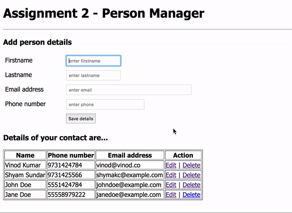

Extend the current assignment to provide an EDIT option.

By clicking the "Edit" link on a particular record, the corresponding data should be loaded to the form. Once the user changes the field values and submits, the data should be saved to the underlying database table. Also the list shows the updated values.

Observe the title above the form too.

